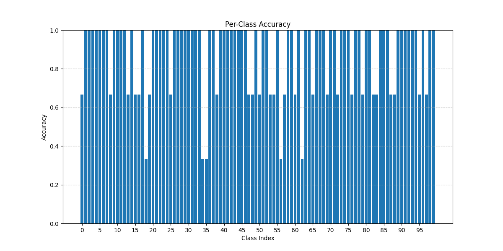

# Biological Image Classification
Visual Recognitionusing Deep Learning HW1

## Project Overview

The project addresses the unique challenges of biological specimen classification through a transfer learning approach with a modified ResNeXt101 architecture. The model achieves 91.3% validation accuracy while staying under the 100M parameter constraint.

#### Key Features

- **Modified ResNeXt101 Architecture**: Custom classifier head with strategic dropout and batch normalization
- **Data Augmentation**: Tailored for biological specimens with variable imaging conditions
- **Label Smoothing**: Implements a smoothing factor of 0.1 to handle taxonomic similarities

## Repository Structure

```
.
├── src/                          # Source code
│   ├── __init__.py               # Package initialization
│   ├── config.py                 # Configuration parameters
│   ├── confusion_matrix.py       # Code for generating confusion matrices
│   ├── dataset.py                # Dataset classes and data loading
│   ├── main.py                   # Main execution script
│   ├── model.py                  # Model architecture definition
│   ├── test.py                   # Code for generate prediction
│   ├── train.py                  # Training script
│   ├── utils.py                  # Utility functions
│   └── visualization.py          # Visualization functions
│
├── .gitignore                    # Git ignore file
├── .pre-commit-config.yaml       # Pre-commit hook configuration
├── README.md                     # This file
├── poetry.lock                   # Poetry dependencies lock file
└── pyproject.toml                # Project configuration and dependencies
```

## Model Architecture

The model is based on ResNeXt101_32x8d with the following modifications:

```python
ModifiedResNet(
  (base_model): ResNeXt101_32x8d(
    ...
    (fc): Sequential(
      (0): Dropout(p=0.3)
      (1): Linear(in_features=2048, out_features=512)
      (2): ReLU()
      (3): BatchNorm1d(512)
      (4): Dropout(p=0.5)
      (5): Linear(in_features=512, out_features=100)
    )
  )
)
```

Key architectural features:
- Initial dropout (p=0.3) to prevent overfitting to ImageNet features
- Dimensionality reduction from 2048 to 512 features
- BatchNorm after ReLU for training stability
- Aggressive final dropout (p=0.5) to encourage feature ensemble effects

## Data Preprocessing and Augmentation

### Training Transforms

```python
train_transform = transforms.Compose([
    transforms.RandomResizedCrop(224, scale=(0.7, 1.0)),
    transforms.RandomHorizontalFlip(),
    transforms.RandomRotation(20),
    transforms.ColorJitter(
        brightness=0.15, contrast=0.15, saturation=0.15, hue=0.1
    ),
    transforms.RandomAffine(
        degrees=0, translate=(0.1, 0.1), scale=(0.9, 1.1)
    ),
    transforms.ToTensor(),
    transforms.Normalize(
        mean=[0.485, 0.456, 0.406], std=[0.229, 0.224, 0.225]
    ),
    transforms.RandomErasing(p=0.2, scale=(0.02, 0.1)),
])
```

### Testing/Validation Transforms

```python
test_transform = transforms.Compose([
    transforms.Resize(256),
    transforms.CenterCrop(224),
    transforms.ToTensor(),
    transforms.Normalize(
        mean=[0.485, 0.456, 0.406], std=[0.229, 0.224, 0.225]
    )
])
```

## Training Configuration

| Parameter | Value |
|-----------|-------|
| Batch size | 64 |
| Initial learning rate | 1e-3 |
| Weight decay | 1e-4 |
| Optimizer | AdamW |
| LR scheduler | ReduceLROnPlateau (factor=0.2, patience=3) |
| Label smoothing | 0.1 |
| Early stopping patience | 10 |
| Random seed | 42 |

## Results

The model achieves the following metrics on the validation set:

| Metric | Value (%) |
|--------|-----------|
| Top-1 Accuracy | 91.3 |
| Top-5 Accuracy | 98.2 |
| F1-Score (macro) | 90.8 |
| Precision (macro) | 91.1 |
| Recall (macro) | 90.5 |

### Performance Visualization

The repository includes several visualizations:

### Training and Validation Curves


### Per-Class Accuracy


### Confusion Matrix


## Getting Started

### Prerequisites

- Python 3.11+
- PyTorch 1.10+
- torchvision
- numpy
- matplotlib
- scikit-learn
- pandas

### Installation

This project uses Poetry for dependency management:

```bash
# Clone the repository
git clone https://github.com/lon5948/Image-Classification.git
cd Image-Classification

# Install dependencies using Poetry
poetry install
```

### Usage

#### Command Line Arguments
```bash
--mode        Mode to run: train, resume, evaluate or test (default: train)
--epochs      Number of epochs to train when resuming (defaults to original setting)
--lr          Learning rate when resuming training (defaults to original setting)
--output      Output file for predictions in CSV format (default: prediction.csv)
```

#### Training

```bash
python -m src.main --mode train
```

#### Resume Training

```bash
python -m src.main --mode resume
# Optional parameters
python -m src.main --mode resume --epochs 10 --lr 0.0001
```

#### Testing

```bash
python -m src.main --mode test --output prediction.csv
```

#### Generating Visualizations

```bash
python -m src.main --mode evaluate
```
